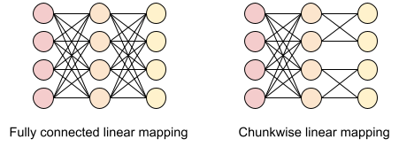
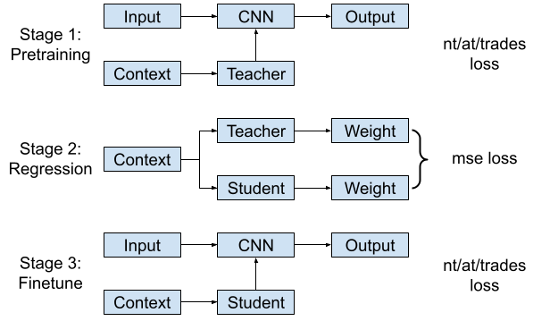

# HyperAdv
Official implementation of "HyperAdv: Dynamic Defense Against Adversarial Radio Frequency Machine Learning Systems"

## Dataset

Experiments are based on [RadioML2018.01A](https://www.deepsig.ai/datasets/) dataset. Please download it from official link and extract to a propriate directory.

## Environment

```
conda env create -n rfadv --file requirements.yml
conda activate rfadv
```

## Models

We first consider MLP as the backbone of hypernet, which produces promising results for both clean data and adversarial data. However, the main drawback to MLP is the computation complexity, making it impractical for resource-constrained scenarios. In practice, we split the second layer of MLP into n independent chunks, which can effectively reduce the number of parameters by n times. The modified architecture is depicted as follow



Models under consideration:

- cnn: the baseline 1d cnn model 
- hyper: large hypernet model (teacher) using fully connected linear mappings
- hyper-s: small hypernet model (student) using chunkwise linear mappings

Pretrained models can be found in [this release](https://github.com/Restuccia-Group/HyperAdv/releases/tag/pretrained-models)

## Training

Remark that the dynamic approach can be an add-on to other static defensive training approaches. To this end, we also consider to train our hypernet with Adversarial Training (AT) and TRADES. 

Training modes under consideration:

- nt: natural training with cross entropy
- at: pgd-based adverasarial training [Paper](https://arxiv.org/pdf/1706.06083)
- trades: trades-style training [Paper](http://proceedings.mlr.press/v97/zhang19p/zhang19p-supp.pdf)

While chunkwise linear can effectively reduce the model size, it hampers the classification performance using conventional end-to-end training. Thus, we use a multi-stage training to preserve the accuracy. Specifically, a large teacher model is first trained with end-to-end training and subsequently a small student model is trained by regressing the output of teacher model. Finally, we finetune the student model for one epoch. The whole procedure is depicted as follow



## Code Usage

To train or test the baseline cnn and hyper model

```
python run_experiment.py -h
usage: run_experiment.py [-h] [-dnn] [-md] [-dp] [-cp] [-d] [-bs] [-t]

options:
  -h, --help           show this help message and exit
  -dnn , --DNN         specify the classifier (cnn, hyper) (default: cnn)
  -md , --Mode         specify the training mode (nt, at, trades) (default:
                       nt)
  -dp , --Data_path    specify the dataset directory (default: ../dataset/2018
                       .01.OSC.0001_1024x2M.h5/2018.01/GOLD_XYZ_OSC.0001_1024.
                       hdf5)
  -cp , --Ckpt_path    specify the checkpoint directory (default: resource/)
  -d , --device        specify the gpu device, -1 means cpu (default: 0)
  -bs , --Batch_size   specify the batchsize (default: 1024)
  -t, --Test_only      Specify training or testing (default: False)
```

To train or test the hyper-s model

```
python run_hyper_s.py -h
usage: run_hyper_s.py [-h] [-md] [-dp] [-cp] [-d] [-bs] [-t]

options:
  -h, --help           show this help message and exit
  -md , --Mode         specify the training mode (nt, at, trades) (default:
                       nt)
  -dp , --Data_path    specify the dataset directory (default: ../dataset/2018
                       .01.OSC.0001_1024x2M.h5/2018.01/GOLD_XYZ_OSC.0001_1024.
                       hdf5)
  -cp , --Ckpt_path    specify the checkpoint directory (default: resource/)
  -d , --device        specify the gpu device, -1 means cpu (default: 0)
  -bs , --Batch_size   specify the batchsize (default: 1024)
  -t, --Test_only      Specify training or testing (default: False)
```